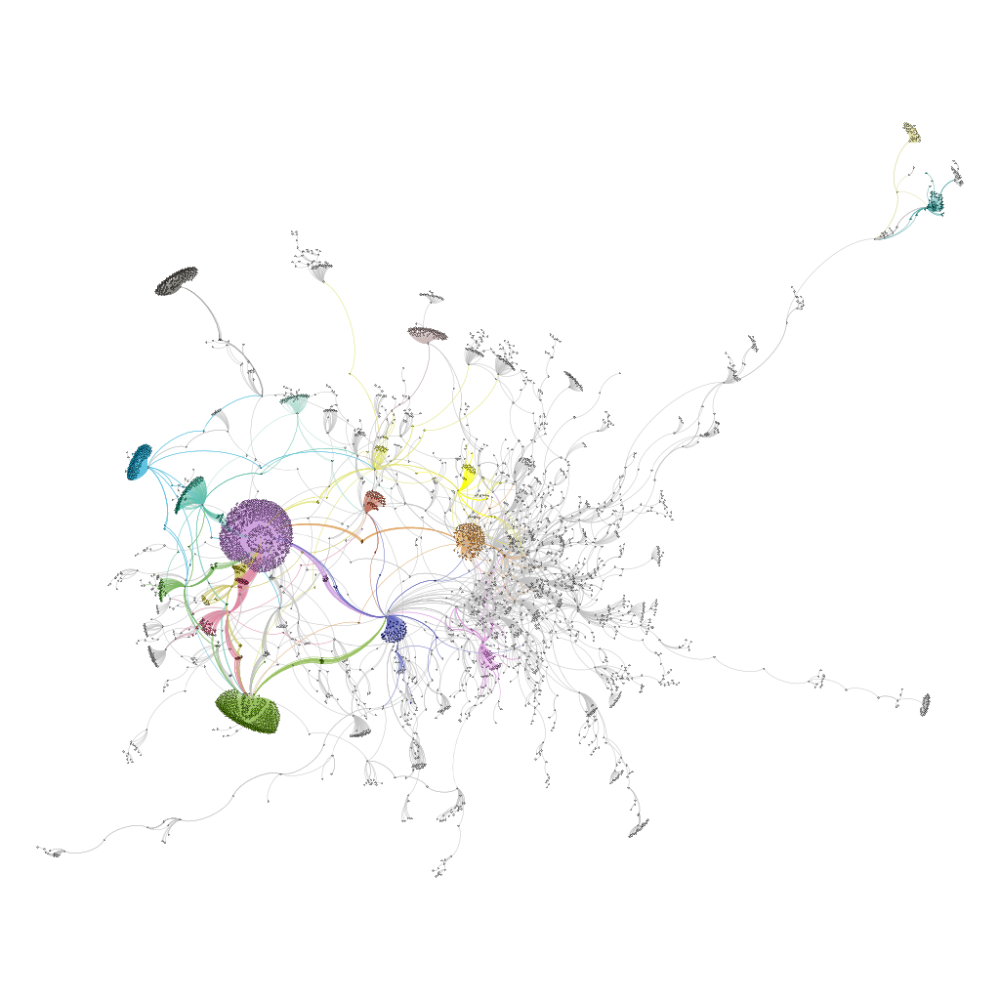

# Scala-SparkProject

The project developed for the second module of the course "Languages and Algorithms for Artificial Intelligence", focused on Functional Programming with Scala and Big Data Analysis with Spark.

The aim of the project is to analyze and study the Ethereum Blockchain as a graph (addresses as nodes and transactions as edges) applying some indices borrowed from the Graph Theory. The project is developed in Scala using Akka for data retrieving and Spark/GraphX for the data analysis. The project has been also successfully tested on AWS using an instance of EMR cluster. More information are avaiable in the report folder.

Figure: A connected component of the graph divided in clusters and rendered on Gephi.
